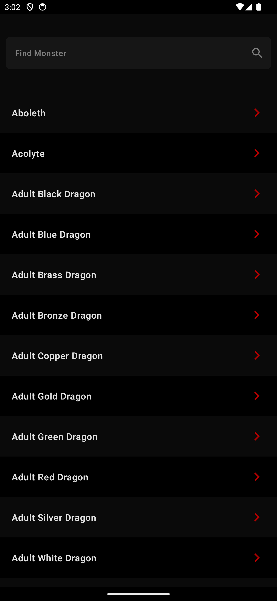
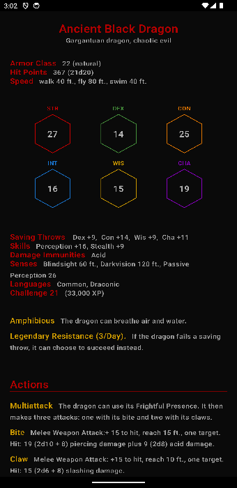

# dnd_handbook_android

This is a native Android App that i create to learn and improve my skills around jetpack compose.

I will use [D&D Api](https://www.dnd5eapi.co/) in this app to show game bestiary and for users
create your characters. I want to
improve the user experience with D&D.
Don't wast your time with game rules, only play the game while the software do the boring things.

I intent to create simple screens and then i will increment with more technologies and improve the
app structure and architecture

I think that's the best way to learn something.

___

## Available Features

Actually you can use bestiary screen (list with all monsters) and monster detail screen (screen with
monster attributes, like a bestiary book)

 

___

## Future Features:

* To begin this project i want to create a screen to show bestiary and each monster details.
* A screen that users can create your characters.
* Local database to users see your characters.
* Screen to users see your characters (local database data)

___

If you think that's you can teach me something about this, don't be shy, i will be happy to receive
anything to help me.

After i will add more information, but for now... that's it.
